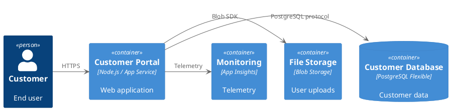

# MVP: Azure Tenant Discovery & Documentation

**Version:** 0.2  
**Date:** November 22, 2025  
**Status:** Planning

> **Note:** This MVP follows the Azure-opinionated approach detailed in [AZURE-APPROACH.md](AZURE-APPROACH.md), using subscription-based organization aligned with Azure Landing Zones, tagging strategies, and separate repos for architecture vs. IaC.

---

## MVP Goal

**Create a tool that can connect to an Azure tenant and automatically generate architecture documentation from existing infrastructure, organized by subscription and following Azure Landing Zones patterns.**

### Core Value Proposition

"Point it at your Azure tenant, and get architecture documentation that follows EA best practices—automatically."

---

## Key Features for Viable Product

### 1. Azure Tenant Discovery

**Capability**: Connect to Azure subscription(s) and discover existing infrastructure

**Technical Approach:**

- Azure Resource Graph queries for fast, cross-subscription discovery
- Azure Migrate API integration for existing assessment data
- Service Map / Dependency Agent data (if available)
- Azure Resource Manager (ARM) metadata extraction

**What We Discover:**

```yaml
infrastructure:
  compute:
    - Virtual Machines (size, OS, tags, diagnostics)
    - App Services (SKU, runtime, slots)
    - Container Instances / AKS clusters
    - Function Apps
  
  data:
    - SQL Databases (server, tier, backup config)
    - Cosmos DB accounts
    - Storage Accounts (type, replication, encryption)
    - PostgreSQL/MySQL Flexible Servers
  
  networking:
    - Virtual Networks (address space, subnets)
    - Network Security Groups (rules)
    - Application Gateways / Load Balancers
    - Private Endpoints
    - VPN/ExpressRoute connections
  
  identity_security:
    - Managed Identities
    - Key Vaults (but not secrets!)
    - Azure AD App Registrations
  
  monitoring:
    - Application Insights
    - Log Analytics Workspaces
    - Action Groups / Alerts
  
  metadata:
    - Resource Tags (environment, owner, cost-center, application)
    - Resource Groups (logical groupings)
    - Locks / Policies applied
    - Last modified dates
```

**Authentication:**

- Service Principal (for automation)
- Azure CLI authentication (for interactive use)
- Managed Identity (when running in Azure)

**Permissions Required:**

```text
Reader role on subscription(s)
+ Optional: Monitoring Reader (for metrics)
+ Optional: Azure Migrate Contributor (for migrate data)
```

### 2. Intelligent Grouping & Organization

**Problem**: A tenant with 500 resources is overwhelming. We need to intelligently group them into logical "solutions" or "applications."

**Approach: Multi-Signal Analysis**

#### Signal 1: Resource Tags

```
Tags like:
- application: "customer-portal"
- environment: "production"
- cost-center: "marketing"
- owner: "platform-team"
```

#### Signal 2: Resource Group Patterns

```
Naming conventions like:
- rg-customerportal-prod
- rg-customerportal-staging
- rg-dataplatform-prod
```

#### Signal 3: Network Topology

```
Resources in same VNet/subnet often belong together:
- VNet: vnet-customerportal-prod
  - Subnet: snet-app
    - App Service
    - Storage Account
  - Subnet: snet-data
    - PostgreSQL
```

#### Signal 4: Azure Migrate Data

```
If Azure Migrate has been run:
- Application groupings
- Dependencies discovered
- Business criticality ratings
```

#### Signal 5: Dependency Analysis

```
From Service Map / NSG flow logs:
- App Service → calls → PostgreSQL
- App Service → calls → Storage Account
- Function App → reads from → Service Bus
```

#### AI-Powered Grouping (Azure OpenAI)

**Prompt to AI:**

```
Given these Azure resources with their tags, names, and relationships:

RESOURCES:
- app-customer-portal-prod (App Service, tags: app=customer-portal, env=prod)
- psql-customer-portal-prod (PostgreSQL, tags: app=customer-portal, env=prod)
- st-customerportal-prod (Storage, tags: app=customer-portal, env=prod)
- appi-customer-portal-prod (App Insights, tags: app=customer-portal, env=prod)
- app-admin-portal-prod (App Service, tags: app=admin-portal, env=prod)
- psql-shared-prod (PostgreSQL, tags: shared=true, env=prod)

RELATIONSHIPS:
- app-customer-portal-prod → psql-customer-portal-prod (connection string)
- app-customer-portal-prod → st-customerportal-prod (blob SDK)
- app-admin-portal-prod → psql-shared-prod

Group these resources into logical applications/solutions and suggest:
1. Application names
2. Resource groupings
3. Environment classifications
4. Confidence level for each grouping
```

**AI Response:**

```yaml
solutions:
  - name: "Customer Portal"
    confidence: 95%
    resources:
      - app-customer-portal-prod
      - psql-customer-portal-prod
      - st-customerportal-prod
      - appi-customer-portal-prod
    environment: production
    rationale: "Strong tag correlation, dedicated resources, clear naming"
  
  - name: "Admin Portal"
    confidence: 80%
    resources:
      - app-admin-portal-prod
    environment: production
    dependencies:
      - psql-shared-prod (shared resource)
    rationale: "Clear tagging, but depends on shared database"
  
  - name: "Shared Data Platform"
    confidence: 70%
    resources:
      - psql-shared-prod
    environment: production
    consumers:
      - Admin Portal
      - (unknown - 2 other IPs)
    rationale: "Tagged as shared, requires manual review"
```

### 3. Automatic Architecture Documentation Generation

**Output Format: Markdown with Frontmatter + C4 Diagrams**

#### Generated Document Example

```markdown
---
title: "Customer Portal"
type: "solution-architecture"
status: "discovered"
lifecycle: "operational"
domain: "customer-experience"
discovery_date: "2025-11-22"
discovery_method: "azure-tenant-scan"
confidence: 95%
azure_subscription: "sub-12345"
resource_groups: ["rg-customerportal-prod"]
estimated_monthly_cost: "$450"
last_modified: "2025-10-15"
tags:
  - discovered
  - customer-facing
  - production
---

# Customer Portal Architecture

> **Note**: This documentation was automatically generated from Azure tenant discovery on 2025-11-22.
> Review and enrich with context, business requirements, and design decisions.

## Overview

**Status**: Operational (discovered in production)  
**Environment**: Production  
**Owner**: Platform Team (from tags)  
**Cost**: ~$450/month (last 30 days)

## Discovered Components

### Compute
- **App Service**: `app-customer-portal-prod`
  - SKU: Premium P1v3 (Linux)
  - Runtime: Node.js 20
  - Scaling: Manual (1 instance)
  - Diagnostics: ✅ App Insights connected

### Data
- **PostgreSQL Flexible Server**: `psql-customer-portal-prod`
  - SKU: Burstable B2s
  - Storage: 32GB (60% used)
  - Backup: Enabled (7 day retention)
  - High Availability: ❌ Not configured

### Storage
- **Storage Account**: `st-customerportal-prod`
  - Type: StorageV2 (General Purpose v2)
  - Replication: LRS (Locally Redundant)
  - Containers: `uploads`, `static-assets`

### Monitoring
- **Application Insights**: `appi-customer-portal-prod`
  - Connected to: app-customer-portal-prod
  - Retention: 90 days

## Architecture Diagram

> **Note**: Diagram auto-generated from discovered dependencies



## Discovered Configuration

### Network Configuration

- **Virtual Network**: vnet-customerportal-prod (10.0.0.0/16)
  - Subnet: snet-app (10.0.1.0/24) - App Service
  - Subnet: snet-data (10.0.2.0/24) - PostgreSQL
- **Private Endpoints**:
  - PostgreSQL (from snet-data)
- **NSG Rules**:
  - Allow HTTPS (443) from Internet → App Service
  - Allow PostgreSQL (5432) from snet-app → snet-data

### Security Configuration

- **Managed Identity**: ✅ Enabled on App Service
- **Key Vault**: ❌ Not discovered (check manually)
- **TLS/SSL**:
  - App Service: ✅ HTTPS only enforced
  - PostgreSQL: ✅ SSL enforced
- **Public Access**:
  - App Service: ✅ Public (expected for web app)
  - PostgreSQL: ✅ Private (via VNet integration)
  - Storage: ⚠️ Public (review if needed)

### Backup & DR

- **PostgreSQL Backups**: ✅ Enabled (7 days)
- **App Service Backups**: ❌ Not configured
- **Geo-Redundancy**: ❌ Single region (East US)

## Cost Breakdown (Last 30 Days)

| Resource | Type | Cost |
|----------|------|------|
| app-customer-portal-prod | App Service | $180 |
| psql-customer-portal-prod | PostgreSQL | $50 |
| st-customerportal-prod | Storage | $15 |
| appi-customer-portal-prod | App Insights | $120 |
| Networking | Various | $85 |
| **Total** | | **$450** |

## Recommendations

> **Auto-generated recommendations from Azure Advisor + AI analysis**

### High Priority

- ⚠️ **No High Availability**: PostgreSQL is single-node. Consider enabling HA for production.
- ⚠️ **App Service Backups**: No backup configured for App Service. Consider backup strategy.
- ⚠️ **Storage Public Access**: Review if public blob access is required.

### Cost Optimization

- 💰 **Reserved Instances**: App Service could save ~30% with reserved capacity
- 💰 **Storage Tier**: Only 5% of blobs accessed in last 30 days, consider cool tier

### Security

- 🔒 **Key Vault**: No Key Vault discovered. Consider for connection strings/secrets.
- 🔒 **WAF**: No Web Application Firewall. Consider Azure Front Door for production.

## Next Steps

- [ ] Review and validate discovered architecture
- [ ] Document business context and requirements
- [ ] Add operational runbook
- [ ] Create ADR for key design decisions
- [ ] Address high-priority recommendations
- [ ] Link to project tracking (Jira/Azure DevOps)

## Metadata

**Discovery Details:**

- Scan Date: 2025-11-22T14:30:00Z
- Scan Method: Azure Resource Graph + ARM API
- Confidence: 95%
- Manual Review Required: Yes

**Tags from Resources:**

- application: customer-portal
- environment: production
- cost-center: marketing
- owner: platform-team
- criticality: high

```

### 4. AI Enrichment (Azure OpenAI in Customer Tenant)

**Key Principle**: AI runs in customer's Azure tenant using Azure OpenAI Service (data stays in tenant)

**AI-Powered Enhancements:**

#### 4.1 Architecture Narrative Generation
```

Input: Raw resource list + relationships
Output: Human-readable overview and architecture description

```

#### 4.2 Diagram Generation Assistance
```

Input: Resources + dependencies
Output: PlantUML C4 diagram code

```

#### 4.3 Recommendations Engine
```

Input: Discovered configuration + Azure Advisor data
Output: Prioritized recommendations with rationale

```

#### 4.4 Documentation Gap Analysis
```

Input: Generated architecture doc
Output: "Missing: business context, SLAs, DR plan, cost justification"

```

#### 4.5 Pattern Recognition
```

Input: Multiple discovered solutions
Output: "3 solutions follow 3-tier pattern, 2 follow serverless pattern"

```

**Azure OpenAI Configuration:**
```yaml
azure_openai:
  deployment_location: "customer_tenant"  # Data never leaves tenant
  endpoint: "https://customer-openai.openai.azure.com/"
  model: "gpt-4o"
  authentication: "managed_identity"
  
  privacy:
    - No data sent to OpenAI (stays in Azure)
    - Customer controls deployment
    - Can use customer's own fine-tuned model
    - Audit logs in customer's tenant
```

### 5. Reuse Azure Migrate Data

**If Azure Migrate Assessment Available:**

```yaml
azure_migrate_integration:
  assessment_data:
    - Application groupings (from agentless discovery)
    - Business criticality ratings
    - Dependencies (from dependency mapping)
    - Performance data (CPU, memory, disk)
    - Migration readiness
  
  usage:
    - Import application groups → Solution structures
    - Import dependencies → Architecture diagrams
    - Import criticality → Priority tags
    - Import perf data → Sizing recommendations
```

**Mapping:**

```
Azure Migrate "Application" → Our "Solution Architecture"
Azure Migrate "Dependency" → Our C4 "Relationship"
Azure Migrate "Business Criticality" → Our "tags: criticality"
```

### 6. Incremental Documentation

**Multi-Pass Approach:**

#### Pass 1: Discovery (Automated)

- Scan Azure tenant
- Identify resources
- Extract metadata and tags
- Detect relationships
- Generate basic markdown docs

#### Pass 2: Grouping (AI-Assisted)

- Apply intelligent grouping
- Generate solution structures
- Create C4 diagrams
- Calculate confidence scores

#### Pass 3: Enrichment (AI + Human)

- AI generates narratives
- AI suggests recommendations
- Human reviews and approves
- Human adds business context

#### Pass 4: Validation (Human)

- Architect validates groupings
- Corrects misidentifications
- Adds missing context
- Merges or splits solutions

#### Pass 5: Ongoing Sync (Automated)

- Daily/weekly re-scans
- Detect drift
- Alert on changes
- Update documentation

---

## MVP Technical Architecture

### Components

```
┌─────────────────────────────────────────────────────────────┐
│                     User / Architect                         │
└──────────────────────┬──────────────────────────────────────┘
                       │ (authenticates)
                       ▼
┌─────────────────────────────────────────────────────────────┐
│              Discovery CLI / Web Portal                      │
│  - Initiate scan                                             │
│  - Review/approve groupings                                  │
│  - Enrich documentation                                      │
└──────────────────────┬──────────────────────────────────────┘
                       │
                       ▼
┌─────────────────────────────────────────────────────────────┐
│              Azure Discovery Engine                          │
│  - Azure Resource Graph queries                              │
│  - Azure Migrate API integration                             │
│  - ARM metadata extraction                                   │
│  - Dependency detection                                      │
└──────────────────────┬──────────────────────────────────────┘
                       │
                       ▼
┌─────────────────────────────────────────────────────────────┐
│         AI Grouping & Analysis Engine                        │
│         (Azure OpenAI in customer tenant)                    │
│  - Intelligent resource grouping                             │
│  - Pattern recognition                                       │
│  - Recommendation generation                                 │
│  - Diagram code generation                                   │
└──────────────────────┬──────────────────────────────────────┘
                       │
                       ▼
┌─────────────────────────────────────────────────────────────┐
│         Documentation Generator                              │
│  - Markdown with frontmatter                                 │
│  - PlantUML C4 diagrams                                      │
│  - Recommendation lists                                      │
│  - Cost breakdowns                                           │
└──────────────────────┬──────────────────────────────────────┘
                       │
                       ▼
┌─────────────────────────────────────────────────────────────┐
│              Git Repository                                  │
│  - /discovered/customer-portal/architecture.md               │
│  - /discovered/admin-portal/architecture.md                  │
│  - /discovered/data-platform/architecture.md                 │
└─────────────────────────────────────────────────────────────┘
```

### Technology Stack (MVP)

```yaml
discovery_engine:
  language: Python
  libraries:
    - azure-mgmt-resource (Resource Graph)
    - azure-mgmt-network (Network topology)
    - azure-identity (Authentication)
    - azure-mgmt-monitor (Metrics/costs)
  
ai_integration:
  service: Azure OpenAI Service
  deployment: Customer's tenant
  model: GPT-4o
  sdk: openai (Azure variant)

documentation_generation:
  format: Markdown + YAML frontmatter
  diagrams: PlantUML (C4 model)
  templating: Jinja2
  
storage:
  primary: Git repository (local or Azure Repos)
  metadata: SQLite (for caching/indexing)
  
ui:
  phase_1: CLI (Python Click)
  phase_2: Web UI (Minimal - FastAPI + HTMX)
```

---

## MVP User Workflow

### First-Time Setup

1. **Install Tool**

   ```bash
   pip install azure-arch-discovery
   # or
   docker run azure-arch-discovery
   ```

2. **Configure Azure Access**

   ```bash
   # Option 1: Use Managed Identity (recommended when running in Azure)
   # No configuration needed - automatic
   
   # Option 2: Use Azure CLI auth
   az login
   
   # Option 3: Use Service Principal
   export AZURE_CLIENT_ID="..."
   export AZURE_CLIENT_SECRET="..."
   export AZURE_TENANT_ID="..."
   ```

3. **Configure Azure OpenAI**

   ```bash
   export AZURE_OPENAI_ENDPOINT="https://your-openai.openai.azure.com/"
   # Uses Managed Identity by default, or:
   export AZURE_OPENAI_KEY="..."
   ```

4. **Initialize and Link to Azure DevOps**

   ```bash
   azure-arch-discovery init \
     --devops-org "https://dev.azure.com/your-org" \
     --devops-project "Architecture" \
     --devops-repo "architecture-docs" \
     --use-managed-identity
   ```

   **What this does:**
   - Creates/clones Azure DevOps Git repository
   - Sets up branch policies (require PR for main)
   - Creates work item tracking templates
   - Configures CI/CD pipeline for documentation publishing
   - Links to Azure OpenAI endpoint
   - Stores config in `.arch-discovery/config.yml`

### Discovery Run

5. **Scan Azure Tenant**

   ```bash
   azure-arch-discovery scan \
     --subscription "prod-subscription" \
     --output ./architecture-repo/discovered \
     --include-migrate-data
   ```

   **Output:**

   ```
   🔍 Scanning Azure subscription: prod-subscription
   📊 Discovered 127 resources across 8 resource groups
   🤖 Analyzing with AI...
   📦 Identified 5 logical solutions with 85% avg confidence
   📝 Generated 5 architecture documents
   ✅ Complete! Review: ./architecture-repo/discovered/
   ```

6. **Review Generated Docs**

   ```bash
   cd architecture-repo/discovered
   ls -la
   # customer-portal/
   # admin-portal/
   # data-platform/
   # shared-services/
   # monitoring-stack/
   ```

7. **Review AI Groupings**

   ```bash
   azure-arch-discovery review
   ```

   **Interactive Prompt:**

   ```
   Solution: "Customer Portal" (Confidence: 95%)
   Resources: app-customer-portal-prod, psql-customer-portal-prod, st-customerportal-prod
   
   [A]pprove  [E]dit  [S]plit  [M]erge  [R]eject
   > A
   
   ✅ Approved. Documentation committed to: discovered/customer-portal/
   ```

8. **Enrich Documentation**
   - Add business context manually
   - Link to ADRs
   - Add operational runbooks
   - Commit to git

9. **View Risk Dashboard**

   ```bash
   azure-arch-discovery risks
   ```

   **Output:**

   ```
   🚨 TOP 10 THINGS TO WORRY ABOUT
   
   CRITICAL (Fix Now)
   1. [Security] PostgreSQL allows public access - 3 databases affected
      Impact: Data breach risk | Cost to fix: Low | Effort: 1 hour
      → Suggested fix available: Run 'fix risk-001'
   
   2. [Reliability] No backup configured - 5 App Services
      Impact: Data loss risk | Cost to fix: $50/month | Effort: 2 hours
      → Suggested fix available: Run 'fix risk-002'
   
   HIGH PRIORITY
   3. [Cost] 12 VMs running 24/7 at <10% CPU utilization
      Impact: $2,400/month waste | Savings: $1,800/month | Effort: 1 day
      → Suggested fix available: Run 'fix risk-003'
   
   4. [Security] 8 storage accounts with public blob access
      Impact: Data exposure risk | Cost to fix: Free | Effort: 2 hours
      → Suggested fix available: Run 'fix risk-004'
   
   5. [Compliance] TLS 1.0/1.1 enabled on 6 App Services
      Impact: Compliance violation | Cost to fix: Free | Effort: 30 min
      → Suggested fix available: Run 'fix risk-005'
   
   View full report: architecture-docs/risks/2025-11-22-risk-report.md
   ```

10. **Apply Suggested Fix (AI-Generated)**

    ```bash
    azure-arch-discovery fix risk-001 --preview
    ```

    **Output:**

    ```
    📋 PROPOSED FIX: Risk-001 - PostgreSQL Public Access
    
    IMPACT ANALYSIS:
    - Resources affected: 3 databases
    - Estimated downtime: None (change is non-breaking)
    - Security improvement: High
    - Cost impact: None
    
    CHANGES:
    ✓ Generated Terraform to disable public network access
    ✓ Generated Terraform to enable private endpoints
    ✓ Generated validation tests
    ✓ Generated rollback plan
    
    FILES CREATED:
    - fixes/risk-001/terraform/main.tf
    - fixes/risk-001/terraform/variables.tf
    - fixes/risk-001/tests/validation.sh
    - fixes/risk-001/rollback.tf
    - fixes/risk-001/CHANGE.md (for ServiceNow)
    
    NEXT STEPS:
    [A]pprove and create ServiceNow change
    [T]est in ephemeral environment
    [R]eview code manually
    [C]ancel
    > A
    
    ✓ Created Azure DevOps PR: #1234
    ✓ Created ServiceNow Change: CHG0012345
    ✓ Linked PR to Change Request
    ✓ Pipeline will deploy to ephemeral environment for testing
    ```

11. **Schedule Regular Syncs**

    ```bash
    # Run weekly to detect changes and update risks
    azure-arch-discovery sync \
      --schedule "0 2 * * 1" \
      --alert-on-drift \
      --update-risk-dashboard
    ```

---

## Risk Dashboard & Prioritization

### "Top 10 Things to Worry About"

**Automatic Risk Assessment:**

```yaml
risk_categories:
  security:
    weight: 10  # Highest priority
    sources:
      - Azure Security Center / Defender
      - Azure Advisor Security recommendations
      - NSG misconfigurations
      - Public endpoints (unexpected)
      - TLS/SSL configuration
      - Managed identity not used
      - Secrets in code/config
  
  reliability:
    weight: 8
    sources:
      - No backup configuration
      - Single region (no HA/DR)
      - No health probes
      - No auto-scaling
      - Resource locks missing (prod)
  
  cost:
    weight: 6
    sources:
      - Underutilized resources (<10% CPU)
      - Oversized resources
      - No reserved instances
      - Storage in hot tier (rarely accessed)
      - Orphaned resources (disk, IP, NIC)
  
  compliance:
    weight: 7
    sources:
      - Azure Policy violations
      - Missing tags (cost-center, owner)
      - Deprecated SKUs/versions
      - Non-compliant encryption
      - Audit logging disabled
  
  operational:
    weight: 5
    sources:
      - No monitoring/alerting
      - Missing diagnostics
      - No runbooks
      - Architecture documentation outdated
```

**Risk Scoring Algorithm:**

```python
risk_score = (
    severity * category_weight * 
    (number_of_resources_affected / total_resources) * 
    business_criticality_multiplier
)

# Example:
# - Critical security issue (severity=10)
# - Security category (weight=10)
# - Affects 3 of 127 resources (0.024)
# - High criticality resource (multiplier=1.5)
# = 10 * 10 * 0.024 * 1.5 = 3.6

# Anything > 5.0 = "Things to worry about"
```

**Dashboard Output (Markdown):**

```markdown
# Risk Dashboard - 2025-11-22

## Executive Summary
- 🔴 **5 Critical** issues requiring immediate action
- 🟠 **8 High** priority issues
- 🟡 **23 Medium** priority issues
- Estimated cost savings: **$3,200/month**
- Estimated security improvement: **High**

---

## 🚨 TOP 10 THINGS TO WORRY ABOUT

### 1. 🔴 CRITICAL - Public Database Access [SECURITY]
**Risk Score: 9.2** | **Affected: 3 resources** | **Detected: 2025-11-22**

**What's wrong:**
- PostgreSQL databases allow public network access
- Resources: `psql-customer-prod`, `psql-admin-prod`, `psql-reporting-prod`
- Firewall rules: `0.0.0.0/0` (allow all)

**Why it matters:**
- Direct internet exposure increases breach risk
- Compliance violation (PCI-DSS, SOC 2)
- No network isolation

**Impact:**
- Security: 🔴 High - Data breach risk
- Compliance: 🔴 High - Violation
- Cost to fix: ✅ Free

**Recommended fix:**
- Disable public network access
- Enable private endpoints (VNet integration)
- Update connection strings (no downtime)

**Effort:** 1-2 hours | **Confidence:** 95%

**Actions:**
- [View Details](risks/risk-001-public-db-access.md)
- [Apply AI-Generated Fix](fixes/risk-001/) ← Terraform ready for review
- [Create Change Request](#) (ServiceNow)

---

### 2. 🔴 CRITICAL - No Backup Strategy [RELIABILITY]
**Risk Score: 8.7** | **Affected: 5 resources** | **Detected: 2025-11-22**

**What's wrong:**
- App Services have no backup configured
- Potential data loss on misconfiguration or deletion
- Resources: `app-customer-portal`, `app-admin-portal`, `app-partner-api`, `app-internal-tools`, `app-reporting-ui`

**Why it matters:**
- Code and configuration changes not backed up
- No point-in-time recovery
- Incident recovery will be slow

**Impact:**
- Reliability: 🔴 High - Data loss risk
- RTO: 🔴 High - Hours to recover
- Cost to fix: $50/month

**Recommended fix:**
- Enable automated backups (1x daily, 7 day retention)
- Backup to separate storage account
- Test restore procedure

**Effort:** 2 hours | **Confidence:** 90%

**Actions:**
- [View Details](risks/risk-002-no-backups.md)
- [Apply AI-Generated Fix](fixes/risk-002/)
- [Create Change Request](#)

---

### 3. 🟠 HIGH - Significant Cost Waste [COST]
**Risk Score: 7.1** | **Affected: 12 resources** | **Savings: $1,800/month**

**What's wrong:**
- 12 VMs running 24/7 with <10% average CPU utilization
- No auto-shutdown configured for dev/test environments
- Resources: `vm-dev-01` through `vm-dev-12`

**Why it matters:**
- Wasting $2,400/month on compute
- Dev/test environments don't need 24/7 runtime

**Impact:**
- Cost: 🟠 High - $1,800/month savings
- Risk: ✅ Low - Safe to implement

**Recommended fix:**
- Implement auto-shutdown (7pm-7am, weekends)
- Evaluate switching to Azure Container Instances for dev
- Consider Azure DevTest Labs pricing

**Effort:** 4-6 hours | **Confidence:** 85%

**Actions:**
- [View Details](risks/risk-003-cost-waste.md)
- [Apply AI-Generated Fix](fixes/risk-003/)
- [Create Change Request](#)

---

[... continued for top 10]

---

## All Risks by Category

### 🔴 Security (15 issues)
- Critical: 3
- High: 5
- Medium: 7

### 🟠 Reliability (12 issues)
- Critical: 2
- High: 4
- Medium: 6

### 💰 Cost (23 issues)
- High: 3
- Medium: 18
- Low: 2

### 📋 Compliance (8 issues)
- High: 2
- Medium: 6

### ⚙️ Operational (19 issues)
- Medium: 14
- Low: 5

---

## Trend Analysis

**This Week vs Last Week:**
- ✅ Resolved: 3 critical issues
- ⚠️ New: 2 high priority issues
- 📉 Risk score decreased: 8.3 → 7.1

**Recent Improvements:**
- Fixed TLS 1.0 deprecation (5 resources)
- Enabled diagnostic logging (8 resources)
- Configured backups (2 resources)

---

Generated by azure-arch-discovery on 2025-11-22
Next scan: 2025-11-29
```

---

## Change Management Workflow

### Integration with ServiceNow

**Automated Change Creation:**

```yaml
# When user approves a fix:
azure-arch-discovery fix risk-001 --approve

# Tool automatically:
1_create_change_request:
  servicenow:
    endpoint: "https://company.service-now.com"
    auth: managed_identity
    change:
      type: "Standard" # or Normal if high risk
      category: "Security Remediation"
      risk: "Low" # Based on AI analysis
      priority: "High"
      
      description: |
        Auto-generated change to remediate Risk-001: Public Database Access
        
        RESOURCES AFFECTED:
        - psql-customer-prod
        - psql-admin-prod
        - psql-reporting-prod
        
        CHANGE DETAILS:
        - Disable public network access on PostgreSQL Flexible Servers
        - Enable private endpoints via VNet integration
        - Update connection strings (application config)
        
        IMPACT ANALYSIS:
        - Downtime: None (non-breaking change)
        - Testing: Automated validation in ephemeral environment
        - Rollback: Automated (stored in fixes/risk-001/rollback.tf)
        
        VALIDATION:
        - Security scan: PASSED
        - Cost impact: $0
        - Compliance: Improves SOC 2 posture
      
      implementation_plan: |
        1. Deploy private endpoints (Terraform)
        2. Update Key Vault connection strings
        3. Restart App Services (rolling, no downtime)
        4. Validate connectivity
        5. Disable public access
        6. Final validation
      
      backout_plan: |
        1. Run rollback Terraform: fixes/risk-001/rollback.tf
        2. Restore original connection strings
        3. Re-enable public access
      
      testing_plan: |
        - Ephemeral environment deployed: test-risk-001-abc123
        - Automated tests: PASSED (fixes/risk-001/tests/)
        - Security validation: PASSED
      
      attachments:
        - Azure DevOps PR: #1234
        - Terraform code: fixes/risk-001/terraform/
        - Test results: fixes/risk-001/test-results.json
        - Architecture impact: risks/risk-001-architecture-impact.md

2_create_azure_devops_pr:
  repository: "architecture-docs"
  branch: "fix/risk-001-public-db-access"
  target: "main"
  
  title: "[Risk-001] Fix PostgreSQL public access vulnerability"
  
  description: |
    ## Change Request
    ServiceNow: CHG0012345
    
    ## Risk Addressed
    Risk-001: Public Database Access (Critical, Score: 9.2)
    
    ## Changes
    - Terraform to disable public network access
    - Private endpoint configuration
    - Updated connection string references
    
    ## Testing
    - Ephemeral environment: PASSED
    - Security validation: PASSED
    - Cost impact: $0/month
    
    ## Approvals Required
    - [ ] Security review
    - [ ] Cost review (waived - no impact)
    - [ ] Architecture review
  
  labels: ["risk-remediation", "security", "auto-generated"]
  
  linked_work_items:
    - CHG0012345 (ServiceNow Change)
    - RISK-001 (Risk tracking)

3_deploy_ephemeral_test_environment:
  terraform:
    workspace: "ephemeral-risk-001-abc123"
    variables:
      environment: "test"
      ephemeral_id: "abc123"
      ttl_hours: 4
    
  resources_created:
    - Test PostgreSQL with private endpoint
    - Test VNet and subnet
    - Test App Service (mini SKU)
  
  tests:
    - connectivity_test: "App → DB via private endpoint"
    - security_validation: "No public access allowed"
    - rollback_test: "Rollback Terraform works"
  
  auto_cleanup: "4 hours or on PR close"

4_update_architecture_docs:
  files_updated:
    - discovered/customer-portal/architecture.md
      changes:
        - Update security section
        - Mark public access as FIXED
        - Add private endpoint to diagram
    
    - risks/risk-001-public-db-access.md
      changes:
        - Status: IN_PROGRESS → FIXED
        - Add remediation date
        - Link to change request
    
    - risks/2025-11-22-risk-report.md
      changes:
        - Remove from top 10
        - Update risk score
```

### Ephemeral Environment Testing

**Automatic Test Environment per Fix:**

```bash
# When PR created, pipeline automatically:

1. Create isolated test environment
   - Terraform workspace: ephemeral-{pr-id}-{random}
   - Deploy minimal versions of affected resources
   - Use test data / synthetic data
   - Tag with ttl=4h

2. Apply proposed changes
   - Run Terraform plan
   - Review for any surprises
   - Apply changes to ephemeral env

3. Run validation tests
   - Connectivity tests
   - Security validation (no public access)
   - Performance baseline
   - Cost estimate

4. Generate report
   - Test results: PASS/FAIL
   - Screenshots/logs
   - Cost projection
   - Security scan results

5. Post to PR
   - Comment with test results
   - Link to test environment (if needed)
   - Recommend approval or highlight issues

6. Auto-cleanup
   - After 4 hours OR
   - When PR is merged/closed
   - Delete all ephemeral resources
   - Verify no orphaned resources
```

**Example Pipeline (Azure DevOps):**

```yaml
# azure-pipelines-fix-validation.yml
trigger:
  branches:
    include:
      - fix/*

pool:
  vmImage: 'ubuntu-latest'

variables:
  EPHEMERAL_ID: $(Build.BuildId)
  EPHEMERAL_TTL: 4h

stages:
  - stage: CreateEphemeralEnv
    jobs:
      - job: Deploy
        steps:
          - task: TerraformInstaller@0
          
          - task: AzureCLI@2
            inputs:
              azureSubscription: 'test-subscription'
              scriptType: 'bash'
              scriptLocation: 'inlineScript'
              inlineScript: |
                cd $(System.DefaultWorkingDirectory)/fixes/$(RISK_ID)/terraform
                terraform init -backend-config="key=ephemeral-$(EPHEMERAL_ID)"
                terraform plan -var="ephemeral_id=$(EPHEMERAL_ID)"
                terraform apply -auto-approve
          
          - bash: |
              echo "##vso[task.setvariable variable=TEST_ENV_URL;isOutput=true]https://test-$(EPHEMERAL_ID).azurewebsites.net"
            name: outputs

  - stage: RunTests
    dependsOn: CreateEphemeralEnv
    jobs:
      - job: ValidationTests
        steps:
          - bash: |
              cd $(System.DefaultWorkingDirectory)/fixes/$(RISK_ID)/tests
              ./connectivity-test.sh
              ./security-validation.sh
              ./cost-estimate.sh
          
          - task: PublishTestResults@2
            inputs:
              testResultsFormat: 'JUnit'
              testResultsFiles: '**/test-results.xml'

  - stage: SecurityScan
    dependsOn: CreateEphemeralEnv
    jobs:
      - job: Checkov
        steps:
          - bash: |
              pip install checkov
              checkov -d $(System.DefaultWorkingDirectory)/fixes/$(RISK_ID)/terraform \
                --output junitxml > security-results.xml
          
          - task: PublishTestResults@2

  - stage: CostAnalysis
    dependsOn: CreateEphemeralEnv
    jobs:
      - job: CostEstimate
        steps:
          - task: AzureCLI@2
            inputs:
              inlineScript: |
                # Use Azure Cost Management API
                az consumption usage list \
                  --start-date $(date -d "1 hour ago" +%Y-%m-%d) \
                  --end-date $(date +%Y-%m-%d) \
                  --query "[?contains(tags.ephemeral_id, '$(EPHEMERAL_ID)')]"

  - stage: GenerateReport
    dependsOn: [RunTests, SecurityScan, CostAnalysis]
    jobs:
      - job: Report
        steps:
          - bash: |
              # Generate markdown report
              python scripts/generate-validation-report.py \
                --test-results tests/results.json \
                --security-results security-results.xml \
                --cost-estimate cost-estimate.json \
                --output validation-report.md
          
          - task: GitHubComment@0
            inputs:
              gitHubConnection: 'github-connection'
              repositoryName: '$(Build.Repository.Name)'
              comment: |
                ## 🧪 Ephemeral Environment Test Results
                
                **Environment**: `ephemeral-$(EPHEMERAL_ID)`
                **Status**: $(TEST_STATUS)
                
                ### Tests
                - ✅ Connectivity: PASSED
                - ✅ Security: PASSED  
                - ✅ Performance: PASSED
                
                ### Cost Impact
                - Current: $450/month
                - After fix: $450/month (no change)
                
                ### Security Scan
                - Checkov: ✅ All checks passed
                - No new vulnerabilities introduced
                
                **Recommendation**: ✅ Approve for deployment
                
                [View full report]($(System.TeamFoundationCollectionUri)$(System.TeamProject)/_build/results?buildId=$(Build.BuildId))

  - stage: Cleanup
    condition: always()
    dependsOn: GenerateReport
    jobs:
      - job: DestroyEphemeral
        steps:
          - task: AzureCLI@2
            inputs:
              inlineScript: |
                cd $(System.DefaultWorkingDirectory)/fixes/$(RISK_ID)/terraform
                terraform destroy -auto-approve
```

---

## ServiceNow Integration Details

### API Integration

```python
# servicenow_integration.py
class ServiceNowIntegration:
    def __init__(self, instance_url: str, use_managed_identity: bool = True):
        self.instance_url = instance_url
        self.auth = ManagedIdentityAuth() if use_managed_identity else None
    
    def create_change_request(self, risk: Risk, fix: ProposedFix) -> str:
        """Create ServiceNow change request with AI-generated details"""
        
        change_request = {
            "type": self._determine_change_type(risk),
            "category": "Security Remediation",
            "priority": self._map_risk_to_priority(risk),
            "risk": self._assess_change_risk(fix),
            
            "short_description": f"[Auto] {risk.title}",
            "description": self._generate_description(risk, fix),
            "implementation_plan": fix.implementation_plan,
            "backout_plan": fix.rollback_plan,
            "test_plan": fix.test_plan,
            
            "start_date": fix.proposed_date,
            "end_date": fix.estimated_completion,
            
            "assignment_group": self._determine_owner(risk),
            "cmdb_ci": self._link_cmdb_items(risk.affected_resources),
            
            "attachments": [
                fix.terraform_code,
                fix.test_results,
                fix.architecture_impact_doc
            ]
        }
        
        response = self.api.create("change_request", change_request)
        return response["number"]  # CHG0012345
    
    def _determine_change_type(self, risk: Risk) -> str:
        """Decide if Standard or Normal change based on risk"""
        if (
            risk.severity == "CRITICAL" or
            risk.impact_score > 8.0 or
            len(risk.affected_resources) > 10
        ):
            return "Normal"  # Requires CAB approval
        else:
            return "Standard"  # Pre-approved, can proceed
    
    def link_to_devops_pr(self, change_number: str, pr_url: str):
        """Add DevOps PR link to change request"""
        self.api.update(
            "change_request", 
            change_number,
            {"work_notes": f"Azure DevOps PR: {pr_url}"}
        )
    
    def update_progress(self, change_number: str, stage: str, status: str):
        """Update change request as deployment progresses"""
        updates = {
            "state": self._map_stage_to_state(stage),
            "work_notes": f"Stage: {stage} - Status: {status}"
        }
        self.api.update("change_request", change_number, updates)
```

### Change Workflow States

```
CREATE → AWAITING_APPROVAL → APPROVED → SCHEDULED → IMPLEMENTING → REVIEW → CLOSED
  ↓                              ↓             ↓            ↓           ↓        ↓
Tool creates              Auto-approved   Pipeline      Ephemeral   PR       Success
with all                  (Standard)      starts        tests       merged   or Rollback
context                   or CAB review   deployment    pass
```

---

## MVP Success Criteria

### Must Have (MVP)

**Discovery & Documentation:**

- ✅ Connect to Azure subscription with Managed Identity
- ✅ Discover resources via Azure Resource Graph
- ✅ Intelligent grouping using AI (70%+ accuracy)
- ✅ Generate markdown docs with C4 diagrams
- ✅ Use Azure OpenAI in customer tenant (data privacy)
- ✅ Output to Azure DevOps Git repository

**Risk Management:**

- ✅ Generate "Top 10 Things to Worry About" dashboard
- ✅ Multi-dimensional risk scoring (security, cost, reliability, compliance)
- ✅ Trend analysis (week-over-week improvements)

**Change Management:**

- ✅ AI-generated fixes (Terraform/Bicep)
- ✅ ServiceNow change request integration
- ✅ Ephemeral environment testing per fix
- ✅ Azure DevOps PR workflow with automated validation

**Validation & Safety:**

- ✅ Security scanning (Checkov/tfsec)
- ✅ Cost impact analysis before deployment
- ✅ Automated rollback plans
- ✅ Human approval required before production changes

### Should Have (MVP+)

- ✅ Azure Migrate data integration
- ✅ Multi-subscription support
- ✅ Scheduled weekly sync with drift detection
- ✅ Integration with Azure Cost Management
- ✅ Compliance mapping (SOC 2, PCI-DSS, etc.)
- ✅ Architecture impact analysis per fix

### Nice to Have (Future)

- Web UI for review and enrichment
- Cross-tenant discovery (for MSPs)
- Integration with existing static site generator
- Advanced Terraform reverse engineering
- Custom risk policies per organization
- Slack/Teams notifications for critical risks
- Historical risk trend charts

---

## Key Risks & Mitigations

### Risk: AI Grouping Accuracy

**Mitigation**:

- Confidence scores on all groupings
- Human review required before commit
- Learn from corrections to improve prompts

### Risk: Data Privacy Concerns

**Mitigation**:

- Azure OpenAI runs in customer tenant
- No data sent to external services
- Clear documentation of data flow
- Option to disable AI (manual grouping only)

### Risk: Permission Issues

**Mitigation**:

- Clear documentation of required roles
- Graceful degradation (skip if no access)
- Test with least-privilege principle

### Risk: Large Tenants (1000+ resources)

**Mitigation**:

- Subscription/resource-group scoping
- Pagination and streaming
- Parallel processing
- Incremental discovery

---

## Next Steps

1. **Validate Concept**: Build proof-of-concept Python script
   - Azure Resource Graph query
   - Basic grouping by tags
   - Generate single markdown doc

2. **Test AI Integration**:
   - Connect to Azure OpenAI
   - Test grouping prompt with sample data
   - Measure accuracy

3. **Build MVP CLI**:
   - `scan`, `review`, `sync` commands
   - Git integration
   - PlantUML generation

4. **Test with Real Tenant**:
   - Run against production subscription
   - Validate groupings
   - Collect feedback

5. **Iterate Based on Feedback**:
   - Improve prompts
   - Add missing features
   - Fix bugs

---

## Related Documents

- [VISION.md](VISION.md) - Overall platform vision
- [TECHNICAL-ARCHITECTURE.md](TECHNICAL-ARCHITECTURE.md) - Full platform architecture
- [AI-CODE-GENERATION.md](AI-CODE-GENERATION.md) - AI code generation workflow (future)

---

**Document Status**: Planning  
**Next Review**: After POC validation  
**Owner**: jbrew
