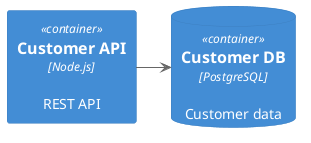

# Enterprise Architecture Repository & Tooling Platform

## Vision Document

**Version:** 1.0  
**Date:** November 22, 2025  
**Audience:** All stakeholders - executives, architects, developers

> **Note**: This is the core vision. See [README.md](README.md) for links to detailed technical, GTM, and implementation documents.  
**Author:** Architecture Tool Working Group

---

## Executive Summary

This document outlines the vision for an open, git-based enterprise architecture repository and tooling platform designed to modernize architecture documentation, enable AI-assisted workflows, and provide flexible artifact management across enterprise, domain, and solution architecture levels.

### Core Philosophy

- **Openness First**: Architecture artifacts should be visible, linkable, and accessible by default (with appropriate permissions)
- **AI-Native**: Markdown + embedded diagrams (PlantUML/Mermaid) as the primary format for AI-assisted architecture work
- **Git-Powered**: Version control at the core, enabling branching, reviewing, and historical tracking
- **Format Flexibility**: Support traditional formats (Visio, Word, PPTX) alongside modern approaches
- **Progressive Enhancement**: Start simple (IDE + Git + Static Site), evolve to full platform with WYSIWYG editors

---

## Problem Statement

Current enterprise architecture tools suffer from:

- **Locked Content**: Architecture artifacts hidden in proprietary tools, SharePoint sites, or personal drives
- **Format Fragmentation**: Mix of Visio, PowerPoint, Word with no standardization
- **Poor Versioning**: Limited or no version control for architecture decisions
- **Integration Gaps**: Difficult to connect architecture artifacts to project management tools
- **Discoverability**: Hard to find relevant architecture decisions, patterns, or prior art
- **AI Incompatibility**: Traditional formats (binary files) don't work well with AI assistants
- **Collaboration Barriers**: Slow review cycles, unclear ownership, difficulty tracking changes

---

## Solution Overview

A hybrid architecture platform combining:

1. **Git-based repository** for markdown artifacts with embedded diagrams
2. **Static site generator** with authentication for web-based browsing/searching
3. **Export engine** for generating traditional formats (PDF, DOCX, PPTX, VSDX)
4. **API layer** for integration with service management tools
5. **Future WYSIWYG editors** for non-technical stakeholders

### Architecture Levels Supported

Following EA-on-a-Page principles:

- **Enterprise Architecture**: Cross-cutting strategies, standards, capabilities
- **Domain Architecture**: Business domain patterns, data models, reference architectures
- **Solution Architecture**: Specific system designs, integration patterns, technical decisions

---

## Key Capabilities

### 1. Content Authoring & Storage

#### Primary Format: Markdown + Frontmatter

```yaml
---
title: "Customer Data Platform Architecture"
type: "solution-architecture"
status: "approved"
lifecycle: "design"
domain: "customer-experience"
architects: ["jbrew", "partner-architect"]
stakeholders: ["product-team", "data-team"]
created: "2025-01-15"
updated: "2025-11-20"
review-date: "2026-01-15"
tags: ["cdp", "data-platform", "real-time"]
related-adrs: ["adr-001", "adr-015"]
jira-epic: "ARCH-123"
---

# Customer Data Platform Architecture

## Context
[Architecture content here...]

## Diagrams
```plantuml
@startuml
!include https://raw.githubusercontent.com/plantuml-stdlib/C4-PlantUML/master/C4_Container.puml
...
@enduml
```

```text

**Benefits:**
- AI can read, analyze, and generate content
- Git provides automatic versioning and branching
- Frontmatter enables metadata-driven organization
- Embedded diagrams maintain single source of truth
```

#### Directory Structure

```text
/architecture-repo/
├── /enterprise/
│   ├── /standards/
│   ├── /capabilities/
│   └── /roadmaps/
├── /domains/
│   ├── /customer-experience/
│   ├── /data-platform/
│   └── /infrastructure/
├── /solutions/
│   ├── /project-alpha/
│   └── /platform-modernization/
├── /adrs/                      # Architecture Decision Records
│   ├── /enterprise/
│   ├── /domain/
│   └── /solution/
├── /templates/                 # EA-on-a-Page aligned templates
├── /patterns/                  # Reusable patterns
└── /reviews/                   # Architecture review artifacts

```

#### Secondary Formats

- **Import Support**: Converters for existing Visio, Word, PowerPoint files
- **Export Generation**: On-demand or pipeline-generated traditional formats
- **Bidirectional Sync**: (Future) Limited support for editing in Word/Visio and syncing back

### 2. Discovery & Search

#### Capabilities

- **Full-text search** across all markdown content
- **Metadata filtering**: By status, domain, architect, tags, lifecycle
- **ADR search**: Find relevant architecture decisions by context
- **Relationship mapping**: "What ADRs relate to this solution?"
- **Change tracking**: "What changed in Q4 2025?"

#### Search Interface

- Web portal with faceted search
- API endpoints for programmatic access
- IDE integration (VS Code extension for local search)

### 3. Architecture Decision Records (ADRs)

Following [Michael Nygard's ADR format](https://cognitect.com/blog/2011/11/15/documenting-architecture-decisions):

```markdown
---
id: "adr-042"
title: "Use Event-Driven Architecture for Customer Notifications"
status: "accepted"
level: "domain"
domain: "customer-experience"
date: "2025-11-15"
supersedes: "adr-019"
---

# ADR-042: Use Event-Driven Architecture for Customer Notifications

## Status
Accepted

## Context
[Decision context...]

## Decision
[What we decided...]

## Consequences
[Impact and trade-offs...]
```

**Features:**

- Hierarchical ADRs (Enterprise > Domain > Solution)
- Status tracking (proposed, accepted, deprecated, superseded)
- Bidirectional linking between ADRs
- Integration with solution artifacts

### 4. Lifecycle Management

#### States

```text
nascent → evaluation → design → approved → implemented → retired
```

#### Workflow (Tag-based)

- **Tags control state**: `lifecycle: nascent`, `lifecycle: approved`
- **Review triggers**: Automatic review reminders based on `review-date`
- **Status dashboards**: Web portal shows artifacts by lifecycle state
- **Transition tracking**: Git commits capture state changes with rationale

#### EA-on-a-Page Integration

Templates based on [eaonapage.com](https://eaonapage.com) framework:

- Business Capability Maps
- Technology Radar
- Architecture Principles
- Reference Architectures
- Integration Patterns

### 5. Export & Format Conversion

#### Export Engine

Pipeline-based generation using tools like:

- **Pandoc**: Markdown → PDF, DOCX
- **PlantUML/Mermaid**: Diagram rendering to PNG/SVG
- **Custom scripts**: PPTX generation from templates
- **Visio export**: (Future) Experimental using diagram metadata

#### Export Options

1. **On-demand**: Web portal "Export as..." button
2. **Pre-built**: Pipeline generates PDFs for all approved docs
3. **Custom templates**: Organization-specific DOCX/PPTX templates
4. **Batch export**: "Export entire domain as PDF portfolio"

### 6. Integration & APIs

#### REST API

```json
GET /api/v1/artifacts?domain=customer-experience&status=approved
GET /api/v1/adrs?level=enterprise
GET /api/v1/search?q=event-driven+architecture
POST /api/v1/artifacts/{id}/review
```

#### Service Tool Integrations

- **Azure DevOps**: Link work items to architecture artifacts
- **Jira**: Embed architecture diagrams in epics/stories
- **ServiceNow**: Reference ADRs in change requests

#### Webhook Support

- Notify Slack/Teams on architecture updates
- Trigger CI/CD on specific artifact changes
- Sync with external documentation systems

### 7. Authentication & Permissions

#### Microsoft Entra ID (Azure AD) Integration

- **SSO**: Single sign-on via M365
- **Group-based permissions**: Map AD groups to architecture domains
- **Guest access**: Easy sharing with partners via M365 guest accounts

#### Permission Model

```yaml
permissions:
  - domain: "customer-experience"
    readers: ["all-employees", "partner-consultants"]
    authors: ["architecture-team", "domain-architects"]
    approvers: ["lead-architects"]
  - domain: "security"
    readers: ["security-team", "architects"]
    authors: ["security-architects"]
```

#### Sharing

- **Direct links**: Share specific artifacts via URL
- **Embedded views**: iFrame embedding for wikis/portals
- **Export sharing**: Generate and share PDFs with external parties

### 8. Review Process

#### Architecture Review Workflow

1. **Submit for Review**: Branch + Pull Request
2. **Review Comments**: Line-by-line feedback in PR
3. **Decision Capture**: ADR created/updated
4. **Approval**: Merge to main branch
5. **Publication**: Automatic site deployment

#### Review Board Portal

- Dashboard of pending reviews
- Assignment to reviewers
- Decision tracking
- Meeting notes linked to artifacts

### 9. Actionable Architecture - From Design to Operations

#### The Problem: Architecture Shelfware

**Common Pattern:**

1. Architect designs beautiful solution ✅
2. Architecture document published 📄
3. Implementation team builds something different ❌
4. Operations inherited undocumented system 😫
5. System runs for years with no updates to architecture 🤷
6. Decommissioning requires archaeology 🔍

**Our Solution: Living, Actionable Architecture**

#### Full Lifecycle Tracking

**Architecture Lifecycle States:**

```yaml
lifecycle_states:
  design:
    - nascent           # "Something to watch/worry about"
    - evaluation        # "Investigating options"
    - design            # "Active design work"
    - approved          # "Ready to build"
  
  implementation:
    - in_progress       # "Being built"
    - deployed_dev      # "In dev/test"
    - deployed_staging  # "In staging"
    - deployed_prod     # "In production"
  
  operations:
    - operational       # "BAU - healthy"
    - degraded          # "Issues identified"
    - deprecated        # "Marked for replacement"
  
  end_of_life:
    - sunset_planned    # "Decommissioning scheduled"
    - sunset_in_progress # "Being decommissioned"
    - retired           # "Fully decommissioned"
```

**Lifecycle Events Tracked:**

- Design approved → Trigger IaC generation
- First deployment → Link to actual infrastructure
- Production deployment → Activate monitoring dashboards
- Security vulnerability detected → Alert architecture owner
- Cost threshold exceeded → Flag for review
- 6 months no updates → Prompt freshness check
- Planned sunset date approaching → Decommission workflow
- Service dependency deprecated → Impact analysis

#### AI Foundry Integration - Code Generation

**Azure AI Foundry Integration:**

```markdown
# Architecture Document (Markdown)
---
title: "Customer API Service"
type: "solution-architecture"
cloud_provider: "azure"
iac_tool: "terraform"
---

## Infrastructure Requirements
- App Service (Premium P1v3)
- PostgreSQL Flexible Server (B2s, 32GB)
- Key Vault for secrets
- Application Insights
- Virtual Network integration

## Architecture Diagram


```

**Generated Artifacts (AI Foundry):**

1. **Terraform Infrastructure Code**
```terraform
# Auto-generated from architecture-tool via Azure AI Foundry
# Source: /solutions/customer-api/architecture.md
# Generated: 2025-11-22

resource "azurerm_resource_group" "customer_api" {
  name     = "rg-customer-api-prod"
  location = "eastus"
  
  tags = {
    architecture_id = "customer-api-v1"
    managed_by      = "architecture-tool"
    source          = "github.com/org/architecture-repo"
  }
}

resource "azurerm_service_plan" "customer_api" {
  name                = "asp-customer-api-prod"
  resource_group_name = azurerm_resource_group.customer_api.name
  location            = azurerm_resource_group.customer_api.location
  os_type             = "Linux"
  sku_name            = "P1v3"
}

# ... full Terraform module generated ...
```

2. **Bicep Alternative**

```bicep
// Auto-generated from architecture-tool via Azure AI Foundry

param location string = 'eastus'
param environment string = 'prod'

resource appServicePlan 'Microsoft.Web/serverfarms@2023-01-01' = {
  name: 'asp-customer-api-${environment}'
  location: location
  sku: {
    name: 'P1v3'
    tier: 'Premium'
  }
}
// ... full Bicep template ...
```

3. **Azure DevOps Pipeline**

```yaml
# Auto-generated deployment pipeline
# Source architecture: /solutions/customer-api/architecture.md

trigger:
  branches:
    include:
      - main
  paths:
    - terraform/customer-api/**

stages:
  - stage: Validate
    jobs:
      - job: TerraformValidate
        steps:
          - task: TerraformInstaller@0
          - task: TerraformTaskV4@4
            inputs:
              command: 'validate'
              
  - stage: Plan
    dependsOn: Validate
    jobs:
      - job: TerraformPlan
        # ... pipeline continues ...
```

4. **GitHub Actions Workflow**

```yaml
# Auto-generated from architecture
name: Deploy Customer API Infrastructure

on:
  push:
    branches: [main]
    paths:
      - 'terraform/customer-api/**'
      - '.github/workflows/customer-api.yml'

jobs:
  terraform:
    runs-on: ubuntu-latest
    steps:
      - uses: actions/checkout@v4
      - uses: hashicorp/setup-terraform@v3
      # ... workflow continues ...
```

5. **Monitoring Dashboard Config**

```json
{
  "dashboard_id": "customer-api-operations",
  "generated_from": "architecture-tool",
  "architecture_source": "/solutions/customer-api/architecture.md",
  "widgets": [
    {
      "type": "metric",
      "title": "API Response Time (p95)",
      "query": "ApplicationInsights | where name == 'GET /api/customers' | summarize percentile(duration, 95)"
    }
  ]
}
```

#### AI Foundry Prompt Engineering

**Architecture → Code Prompt Template:**

```
You are an infrastructure-as-code expert. Generate production-ready Terraform code based on this architecture document.

CONTEXT:
- Cloud Provider: {cloud_provider}
- Environment: {environment}
- Compliance Requirements: {compliance_tags}

ARCHITECTURE REQUIREMENTS:
{parsed_architecture_requirements}

CONSTRAINTS:
- Follow {organization} naming conventions
- Use {organization} approved modules from {module_registry}
- Include standard tags: cost_center, owner, environment
- Enable diagnostics and monitoring by default
- Use managed identities (no secrets in code)

DIAGRAM ANALYSIS:
{c4_diagram_parsed}
Identified components: {components_list}
Identified relationships: {relationships_list}

OUTPUT FORMAT:
- Modular Terraform (separate files for network, compute, data)
- Include variables.tf with descriptions
- Include outputs.tf for resource IDs
- Include README.md with deployment instructions
- Generate CI/CD pipeline for Azure DevOps

GENERATE:
```

#### Integration Architecture

```
┌─────────────────────────────────────────────────────────────┐
│                    Architecture Repository                   │
│                  (Markdown + PlantUML/Mermaid)               │
└──────────────────────┬──────────────────────────────────────┘
                       │
                       ▼
┌─────────────────────────────────────────────────────────────┐
│              Architecture Parser & Analyzer                  │
│  - Extract infrastructure requirements from markdown         │
│  - Parse C4 diagrams (PlantUML/Mermaid)                      │
│  - Identify components, relationships, dependencies          │
│  - Map to cloud provider resources                           │
└──────────────────────┬──────────────────────────────────────┘
                       │
                       ▼
┌─────────────────────────────────────────────────────────────┐
│                  Azure AI Foundry                            │
│  - GPT-4 or Azure OpenAI for code generation                 │
│  - Prompt engineering with org standards                     │
│  - Multi-pass validation (syntax, security, compliance)      │
│  - Generate: Terraform, Bicep, Pipelines, Dashboards         │
└──────────────────────┬──────────────────────────────────────┘
                       │
                       ▼
┌─────────────────────────────────────────────────────────────┐
│                 Generated Code Repository                    │
│  - Separate Git repo (or /generated folder)                  │
│  - Linked back to source architecture                        │
│  - Versioned alongside architecture changes                  │
└──────────────────────┬──────────────────────────────────────┘
                       │
                       ▼
┌─────────────────────────────────────────────────────────────┐
│                      CI/CD Pipeline                          │
│  - Validate generated code                                   │
│  - Run security scans (Checkov, tfsec)                       │
│  - Deploy to environments (dev → staging → prod)             │
│  - Update architecture status automatically                  │
└──────────────────────┬──────────────────────────────────────┘
                       │
                       ▼
┌─────────────────────────────────────────────────────────────┐
│              Deployed Infrastructure (Azure)                 │
│  - Tagged with architecture_id for traceability              │
│  - Monitored via generated dashboards                        │
│  - Cost tracked per architecture artifact                    │
└──────────────────────┬──────────────────────────────────────┘
                       │
                       ▼
┌─────────────────────────────────────────────────────────────┐
│            Operations & Feedback Loop                        │
│  - Azure Monitor → Architecture health dashboard             │
│  - Cost Management → Architecture cost attribution           │
│  - Incidents → Update architecture documentation             │
│  - Drift detection → Alert architecture owner                │
└──────────────────────┬──────────────────────────────────────┘
                       │
                       └─────────► (Updates architecture docs)
```

#### Operational Integration Features

##### 1. Live Infrastructure Mapping

**Problem**: Architecture docs describe design, but what's actually deployed?

**Solution**: Bidirectional linking between architecture and live resources

```yaml
# In architecture frontmatter
---
title: "Customer API Service"
deployed_resources:
  production:
    subscription: "sub-12345"
    resource_group: "rg-customer-api-prod"
    app_service: "app-customer-api-prod"
    database: "psql-customer-api-prod"
    last_synced: "2025-11-22T10:30:00Z"
  staging:
    subscription: "sub-12345"
    resource_group: "rg-customer-api-staging"
---
```

**Architecture Portal Features:**

- **Live Status Badge**: Shows if service is running, degraded, or down
- **Cost Dashboard**: Actual spend vs. estimated (from architecture)
- **Compliance Status**: Azure Policy compliance for deployed resources
- **Drift Detection**: "3 resources deployed don't match architecture"
- **One-click to Azure Portal**: Jump directly to resource group

##### 2. Architecture Quality Metrics

**Automated Quality Checks:**

```yaml
quality_checks:
  completeness:
    - has_context_diagram: true
    - has_container_diagram: true
    - has_deployment_diagram: false  # ⚠️ Missing
    - has_security_section: true
    - has_cost_estimate: true
    - has_operational_runbook: false  # ⚠️ Missing
    score: 70/100
    
  freshness:
    - last_updated: "2025-06-15"  # 5 months ago
    - deployment_date: "2025-07-01"
    - delta_days: -16  # ⚠️ Architecture updated BEFORE deployment
    - recommendation: "Update architecture to match prod deployment"
    
  dependencies:
    - documented_dependencies: 3
    - actual_dependencies: 5  # ⚠️ 2 undocumented
    - missing: ["Notification Service", "Legacy CRM API"]
    
  alignment:
    - follows_enterprise_standards: 85%
    - uses_approved_patterns: true
    - security_review_completed: true
    - cost_review_completed: false  # ⚠️ Missing
```

**Quality Dashboard:**

- **Portfolio View**: All architectures with quality scores
- **Red/Amber/Green** status per artifact
- **Actionable Recommendations**: "Add operational runbook", "Update deployment diagram"
- **Trend Analysis**: Quality improving or degrading over time?

##### 3. Integration with Service Management

**ServiceNow Integration:**

```javascript
// When incident created in ServiceNow
POST /api/v1/incidents
{
  "incident_id": "INC0012345",
  "affected_service": "Customer API",
  "architecture_id": "customer-api-v1",
  "severity": "P1"
}

// Architecture tool response:
{
  "architecture_url": "https://arch.company.com/solutions/customer-api",
  "runbook_url": "https://arch.company.com/solutions/customer-api/runbook",
  "on_call_architect": "jbrew@company.com",
  "recent_changes": [
    {
      "date": "2025-11-15",
      "change": "Added caching layer",
      "pr_url": "https://github.com/org/arch/pull/234"
    }
  ],
  "dependent_services": ["Order Processing", "CRM Sync"],
  "estimated_impact": "High - 3 downstream services affected"
}
```

**Jira/Azure DevOps Integration:**

```yaml
# Epic/Work Item enrichment
epic_id: "ARCH-123"
linked_architecture: "/solutions/customer-api/architecture.md"
implementation_status:
  - requirement: "PostgreSQL with 32GB storage"
    status: "✅ Deployed"
    resource_id: "/subscriptions/.../psql-customer-api-prod"
  - requirement: "Premium P1v3 App Service"
    status: "⚠️ Deployed as P1v2 (wrong SKU)"
  - requirement: "Application Insights"
    status: "❌ Not deployed"
completion_percent: 66%
drift_issues: 2
```

##### 4. End-of-Life Management

**Sunset Workflow:**

```markdown
---
title: "Legacy Customer API v1"
lifecycle: "sunset_planned"
sunset_date: "2026-03-31"
replacement: "/solutions/customer-api-v2/architecture.md"
---

## Decommissioning Plan

### Dependencies to Migrate
- [x] Mobile App (migrated 2025-10-01)
- [x] Web Portal (migrated 2025-11-15)
- [ ] Partner Integration (migration in progress)
- [ ] Legacy Reporting Tool (blocked - needs rebuild)

### Infrastructure to Decommission
- [ ] App Service: app-customer-api-v1-prod
- [ ] Database: psql-customer-api-v1-prod (⚠️ contains historical data)
- [ ] Storage Account: stcustapiv1prod

### Automated Checks
- Last request received: 2025-11-20 (2 days ago)
- Request volume (30d): 1,234 requests (98% decrease)
- Remaining dependencies: 2 services
- Estimated monthly cost if retired: $450 savings
```

**Automated Sunset Reminders:**

- 90 days before: Alert architecture owner, stakeholders
- 60 days: Auto-create decommission project in Azure DevOps
- 30 days: Email weekly status updates
- 7 days: Final warning to remaining consumers
- Sunset date: Automated shutdown (configurable)
- +30 days: Verify no zombie resources remain

##### 5. Architecture Fitness Functions

**Continuous Architecture Validation:**

```python
# Example fitness function (runs in pipeline)
def check_security_compliance(architecture_id):
    """Ensure deployed resources match security requirements"""
    
    arch = get_architecture(architecture_id)
    deployed = get_azure_resources(arch.resource_group)
    
    checks = [
        validate_network_isolation(deployed),
        validate_encryption_at_rest(deployed),
        validate_managed_identity_usage(deployed),
        validate_no_public_endpoints(deployed),
        validate_diagnostic_logging(deployed)
    ]
    
    failures = [c for c in checks if not c.passed]
    
    if failures:
        create_github_issue(
            title=f"Security compliance drift: {architecture_id}",
            body=format_failures(failures),
            assignee=arch.owner
        )
    
    return len(failures) == 0
```

**Automated Drift Detection:**

- **Daily scans**: Compare deployed resources vs. architecture
- **Alert on drift**: "App Service scaled to P2v3 (architecture specifies P1v3)"
- **Suggest updates**: "Update architecture to match production" OR "Revert production to match architecture"

##### 6. Cost Governance

**Architecture Cost Tracking:**

```yaml
# In architecture document
cost_estimate:
  monthly_estimated: $1,200
  breakdown:
    - service: "App Service P1v3"
      estimated: $180
    - service: "PostgreSQL Flexible B2s"
      estimated: $50
    - service: "Application Insights"
      estimated: $100
    - service: "Virtual Network"
      estimated: $10

cost_actual:
  monthly_actual: $1,850  # ⚠️ 54% over estimate!
  variance_percent: +54%
  top_cost_drivers:
    - service: "PostgreSQL"
      actual: $250  # 5x estimate!
      issue: "Database grew to 128GB (estimated 32GB)"
    - service: "Data Transfer"
      actual: $400  # Not estimated!
      issue: "Unexpected cross-region traffic"
```

**Cost Governance Features:**

- **Budget Alerts**: Notify when actual costs exceed estimate by threshold
- **Portfolio View**: Total cost of all architectures
- **FinOps Integration**: Tag resources with architecture_id for chargebacks
- **Optimization Recommendations**: "Consider reserved instances for 30% savings"

#### AI Foundry - Advanced Features

##### Architecture Improvement Suggestions

```
User: "Review my architecture for improvements"

AI Foundry Analysis:
- ✅ Good: You're using managed identities
- ⚠️ Consider: Adding a CDN for static assets (20% cost reduction)
- ⚠️ Security: PostgreSQL allows public network access
- ⚠️ Resilience: Single region deployment (no DR)
- ⚠️ Performance: Missing read replicas for database
- 💡 Similar Pattern: See "High-Scale API Pattern" for reference

Generated Recommendations:
- [ ] Add Azure Front Door (CDN)
- [ ] Configure PostgreSQL firewall rules
- [ ] Design multi-region failover
- [ ] Evaluate read replicas for reporting workload
```

##### Migration Path Generation

```
User: "Generate migration plan from on-prem to Azure"

AI Foundry Output:
1. Current State Analysis (from architecture doc)
2. Target State Architecture (generated)
3. Migration Phases:
   - Phase 1: Lift-and-shift VMs (2 weeks)
   - Phase 2: Refactor to PaaS (4 weeks)
   - Phase 3: Optimize and modernize (2 weeks)
4. Risk Assessment
5. Rollback Procedures
6. Generated Terraform for target state
```

##### Compliance Mapping

```
User: "Check if this architecture meets SOC 2 requirements"

AI Foundry Analysis:
SOC 2 Control Mapping:
- CC6.1 (Logical Access): ✅ Uses Entra ID
- CC6.6 (Encryption): ⚠️ Partial - storage encryption missing
- CC6.7 (Transmission): ✅ HTTPS enforced
- CC7.2 (Monitoring): ⚠️ Missing - no log aggregation
- CC8.1 (Change Management): ✅ IaC in Git

Remediation Steps:
1. Enable encryption for storage accounts
2. Configure Log Analytics workspace
3. Document change management process in runbook
```

---

## Technical Architecture

### Phase 1: MVP (Self-Hosted Static Site)

#### Stack

- **Repository**: Git (GitHub/GitLab/Azure Repos)
- **Static Site Generator**: Hugo, Docusaurus, or MkDocs Material
- **Diagram Rendering**: Kroki (supports PlantUML/Mermaid/etc.)
- **Search**: Algolia or local search (Lunr.js)
- **Hosting**: Self-hosted VM, Docker container, or cloud static hosting
- **Authentication**: OAuth2 proxy with Entra ID

#### Pipeline

```yaml
# .github/workflows/deploy.yml
on: push
jobs:
  build:
    - Validate markdown/frontmatter
    - Render diagrams (PlantUML/Mermaid)
    - Generate static site
    - Deploy to hosting
    - Generate PDF exports (optional)
```

#### Components

```text
┌─────────────────────────────────────────────────┐
│              Git Repository                     │
│  (Markdown + Diagrams + Frontmatter)            │
└──────────────────┬──────────────────────────────┘
                   │
                   ▼
┌─────────────────────────────────────────────────┐
│           CI/CD Pipeline                        │
│  - Validate content                             │
│  - Render diagrams (Kroki/PlantUML)             │
│  - Build static site (Hugo/Docusaurus)          │
│  - Deploy to web server                         │
└──────────────────┬──────────────────────────────┘
                   │
                   ▼
┌─────────────────────────────────────────────────┐
│         Static Web Portal                       │
│  - Browse/Search artifacts                      │
│  - View diagrams                                │
│  - Export as PDF/DOCX                           │
│  - Authentication (OAuth2 + Entra ID)           │
└─────────────────────────────────────────────────┘
```

### Phase 2: Enhanced Platform

#### Additional Components

- **Database**: PostgreSQL for metadata indexing
- **API Server**: Node.js/Python REST API
- **Export Service**: Dedicated service for format conversion
- **Integration Hub**: Connectors for Azure DevOps, Jira, ServiceNow
- **Analytics**: Usage tracking, popular artifacts, coverage metrics

### Phase 3: Full Platform

#### Advanced Features

- **WYSIWYG Markdown Editor**: Web-based editing (e.g., Tiptap, ProseMirror)
- **Visual Diagram Editor**: Web-based diagram editing (e.g., draw.io integration)
- **Real-time Collaboration**: Multi-user editing
- **Version Comparison**: Visual diff of architecture changes
- **AI Assistant**: Chatbot for architecture queries, content generation
- **Automated Compliance**: Check artifacts against enterprise standards

---

## Comparison with Existing Tools

### Structurizr

**Similarities:**

- C4 model support
- Code-based architecture (DSL)
- Git-friendly

**Differences:**

- **Structurizr**: Focused on C4 diagrams, proprietary DSL
- **Our Tool**: Broader scope (ADRs, documentation, multi-format), standard markdown

**What to Adopt:**

- C4 model best practices
- DSL concepts for diagram definitions
- Interactive diagram navigation

### IcePanel

**Similarities:**

- Modern browser-based experience
- C4 model support
- Draft/review workflow

**Differences:**

- **IcePanel**: SaaS-only, visual modeling tool, not git-native
- **Our Tool**: Self-hosted option, git-native, markdown-first

**What to Adopt:**

- Multiple audience views (different abstraction levels)
- Interactive diagram exploration
- Feedback/annotation features

### Ardoq

**Similarities:**

- Enterprise architecture focus
- Integration with service tools
- Metadata-driven organization

**Differences:**

- **Ardoq**: Enterprise SaaS, data-driven repository, complex pricing
- **Our Tool**: Open/self-hosted, simpler model, git-based

**What to Adopt:**

- Business capability mapping
- Application portfolio management
- Dependency visualization
- ROI/cost tracking integration

### Key Differentiators

| Feature | Our Tool | Structurizr | IcePanel | Ardoq |
|---------|----------|-------------|----------|-------|
| **Git-Native** | ✅ Core | ✅ Yes | ❌ No | ❌ No |
| **Markdown-Based** | ✅ Yes | ⚠️ DSL | ❌ No | ❌ No |
| **Self-Hosted** | ✅ Yes | ✅ Yes | ❌ No | ❌ No |
| **AI-Friendly** | ✅ Yes | ⚠️ Partial | ❌ No | ❌ No |
| **Multi-Format Export** | ✅ Yes | ⚠️ Limited | ⚠️ Limited | ✅ Yes |
| **Traditional Tool Support** | ✅ Yes | ❌ No | ❌ No | ⚠️ Partial |
| **ADR Management** | ✅ Native | ⚠️ External | ⚠️ Limited | ⚠️ Limited |
| **EA Framework** | ✅ EA-on-a-Page | ❌ No | ❌ No | ✅ Multiple |
| **Cost (Self-Hosted)** | 💰 Free | 💰 Free (OSS) | 💰💰 SaaS | 💰💰💰 Enterprise |

---

## Deployment Models

### Option 1: Individual/Small Team (Free)

- Git repository (GitHub/GitLab free tier)
- GitHub Pages for static hosting
- Manual or GitHub Actions pipeline
- Local editing in VS Code
- **Cost**: $0/month

### Option 2: Organization Self-Hosted

- Private Git server or cloud Git (Azure Repos, GitLab)
- Self-hosted web server (VM/Docker)
- Entra ID integration
- CI/CD pipeline (Azure Pipelines, GitLab CI)
- **Cost**: Infrastructure only (~$50-200/month)

### Option 3: Managed Service (Future)

- Multi-tenant SaaS platform
- Per-user or per-organization pricing
- Managed updates and backups
- Premium features (WYSIWYG, advanced analytics)
- **Cost**: TBD (likely $10-30/user/month)

---

## Implementation Roadmap

### Phase 1: Foundation (Months 1-3)

- [ ] Define repository structure and templates
- [ ] Select static site generator (Hugo/Docusaurus)
- [ ] Implement basic authentication (OAuth2 + Entra ID)
- [ ] Create EA-on-a-Page aligned templates
- [ ] Build CI/CD pipeline for site generation
- [ ] Deploy MVP to test environment
- [ ] Migrate 5-10 sample artifacts

**Success Criteria:**

- 5 architects can author content in markdown
- Static site displays artifacts with search
- Diagrams render correctly (PlantUML/Mermaid)
- Authentication works with M365

### Phase 2: Enhanced Features (Months 4-6)

- [ ] Implement PDF/DOCX export
- [ ] Build metadata search (tags, lifecycle, etc.)
- [ ] Create ADR template and workflow
- [ ] Integrate with Azure DevOps (link artifacts to work items)
- [ ] Add architecture review workflow (PR-based)
- [ ] Develop API v1 (read-only)
- [ ] Onboard 50+ viewers

**Success Criteria:**

- Exports match organization branding
- ADRs tracked and searchable
- Azure DevOps links functional
- 80% of new architecture in markdown

### Phase 3: Integration & Scale (Months 7-12)

- [ ] Jira/ServiceNow integration
- [ ] API v2 (write operations)
- [ ] Advanced search (full-text, relationships)
- [ ] Analytics dashboard (usage, coverage)
- [ ] Import tools for legacy formats
- [ ] Performance optimization (100+ artifacts)
- [ ] Multi-tenant data model (if offering as service)

**Success Criteria:**

- 100+ artifacts published
- Service tool integrations used in projects
- API adopted by 2+ internal tools
- Migration of all active architecture

### Phase 4: Platform Maturity (Year 2)

- [ ] WYSIWYG markdown editor
- [ ] Visual diagram editor (optional)
- [ ] Real-time collaboration features
- [ ] AI assistant integration
- [ ] Automated compliance checking
- [ ] Mobile-responsive portal improvements
- [ ] White-label option for external clients

**Success Criteria:**

- Non-technical stakeholders author content
- AI assistant answers 80% of queries correctly
- Tool used across multiple partner organizations (if service)

---

## Open Questions & Decisions Needed

### Content Migration

- **Q**: How to handle 100+ existing Visio/PowerPoint files?
- **Options**:
  1. Leave as attachments, new work in markdown
  2. Manual conversion (prioritize by importance)
  3. Automated conversion (experimental, may require cleanup)
- **Recommendation**: Option 1 with gradual Option 2

### Diagram Tooling

- **Q**: Which diagram formats to prioritize?
- **Options**: PlantUML, Mermaid, draw.io, D2, Graphviz
- **Recommendation**: PlantUML (C4 support) + Mermaid (simpler syntax)

### Multi-Tenant Architecture

- **Q**: If offering as service, shared infrastructure or isolated?
- **Recommendation**: Defer until Phase 3, shared DB with row-level security

### WYSIWYG Priority

- **Q**: When to invest in browser-based editing?
- **Recommendation**: After Phase 2 success (user demand validates investment)

---

## Success Metrics

### Adoption

- **Authors**: Number of architects contributing content
- **Artifacts**: Number of architecture documents in markdown
- **ADRs**: Number of decisions tracked
- **Viewers**: Unique users accessing portal per month

### Quality

- **Freshness**: % of artifacts updated in last 6 months
- **Review Coverage**: % of artifacts that passed review process
- **Completeness**: % of projects with linked architecture artifacts

### Impact

- **Search Usage**: Searches per user per month
- **Reuse**: Number of patterns/templates used across solutions
- **Integration**: Number of API calls from service tools
- **Time Savings**: Reduction in "where's the architecture?" questions

### Platform Health

- **Uptime**: 99.5% availability target
- **Build Success**: 95% successful pipeline runs
- **Search Performance**: <2 second search results
- **Export Success**: 95% successful format conversions

---

## Risks & Mitigations

### Risk: Low Adoption of Markdown

- **Impact**: Team reverts to Word/Visio
- **Mitigation**:
  - Provide training and templates
  - Show AI benefits early
  - Allow hybrid approach initially

### Risk: Export Quality Issues

- **Impact**: Stakeholders reject generated docs
- **Mitigation**:
  - Invest in quality templates
  - Allow manual post-export editing
  - Collect feedback and iterate

### Risk: Authentication Complexity

- **Impact**: Difficult to share with partners
- **Mitigation**:
  - M365 guest accounts
  - Pre-generated PDF sharing
  - Public/private artifact flagging

### Risk: Performance at Scale

- **Impact**: Slow search/rendering with 1000+ artifacts
- **Mitigation**:
  - Implement caching
  - Pagination and lazy loading
  - Database indexing for metadata

### Risk: Vendor Lock-in

- **Impact**: Difficult to migrate away
- **Mitigation**:
  - Use open standards (markdown, PlantUML)
  - Keep git as source of truth
  - Provide export all data feature

---

## Distribution & Go-to-Market Strategy

### Azure Marketplace Opportunity

**Why Azure Marketplace is Ideal:**

- **Target Audience Alignment**: Enterprise customers already using Azure/M365
- **Native Integration**: Entra ID (Azure AD) authentication is table stakes for marketplace apps
- **Procurement Simplicity**: Customers can use existing Azure commitments (MACC - Microsoft Azure Consumption Commitment)
- **Trust & Discovery**: Microsoft's vetting process provides credibility
- **Co-sell Potential**: Microsoft partner ecosystem and field seller relationships

### Marketplace Listing Options

#### Option 1: Azure Managed Application

**Package as:**

- ARM/Bicep template that deploys entire stack
- Includes: Container Apps, PostgreSQL, Storage, App Service
- Customer deploys in their own Azure subscription
- You manage updates via publisher-controlled deployments

**Pricing Models:**

- Per-user/month metered billing
- Flat rate per organization
- Bring-your-own-license (BYOL) for self-managed

**Pros:**

- Runs in customer's tenant (data sovereignty)
- Customer controls infrastructure
- Good for regulated industries

**Cons:**

- Customer bears Azure infrastructure costs
- Support complexity (their environment)

#### Option 2: SaaS Offer (Multi-Tenant)

**Package as:**

- Fully managed service
- Customer subscribes, gets provisioned workspace
- You operate all infrastructure
- Integration via Entra ID tenant linking

**Pricing Models:**

- Per-user/month subscription
- Tiered plans (Starter/Professional/Enterprise)
- Usage-based (API calls, storage)

**Pros:**

- Simplest for customer (no infra management)
- Easier support and updates
- Better unit economics at scale

**Cons:**

- Must handle multi-tenancy security
- Data residency questions
- Higher initial infrastructure investment

#### Option 3: Container Offer (Azure Container Apps)

**Package as:**

- Helm chart or container image
- Deploys to customer's Azure Kubernetes Service or Container Apps
- Lighter weight than Managed App

**Pricing:**

- BYOL model
- Support subscriptions

**Pros:**

- Modern deployment model
- Flexible for customers with existing K8s
- Lower entry barrier

**Cons:**

- Customer needs container orchestration knowledge
- Limited billing integration

### Recommended Approach: Hybrid Strategy

**Phase 1 (Year 1): BYOL Container Offer**

- Publish container image to Azure Marketplace
- Docker Compose / Helm chart for easy deployment
- Free tier + paid support plans
- Validate market fit with minimal infrastructure cost
- **Revenue**: Support contracts ($5-10K/org/year)

**Phase 2 (Year 2): Azure Managed Application**

- ARM/Bicep template for one-click deployment
- Per-user metered billing via marketplace
- Targets mid-market (50-500 users)
- **Revenue**: $15-30/user/month (marketplace takes 20%)

**Phase 3 (Year 3): SaaS Multi-Tenant Offer**

- Fully managed service
- Tiered pricing (Starter/Pro/Enterprise)
- Target SMBs and enterprises wanting zero ops
- **Revenue**: $10-25/user/month SaaS + custom enterprise deals

### Competitive Marketplace Positioning

**Differentiation vs. Existing Tools:**

| Feature | Your Tool | Ardoq (Not on Marketplace) | Competitors |
|---------|-----------|---------------------------|-------------|
| **Azure Marketplace** | ✅ Native | ❌ Direct sales | ⚠️ Few options |
| **MACC Eligible** | ✅ Yes | ❌ No | ⚠️ Limited |
| **Git-Native** | ✅ Core | ❌ No | ❌ Rare |
| **Self-Host Option** | ✅ Yes | ❌ No | ⚠️ Few |
| **AI-Ready Format** | ✅ Markdown | ❌ Proprietary | ❌ Binary |
| **Price Point** | 💰 Low-Mid | 💰💰💰 Enterprise | 💰💰 Mid |

**Marketplace Listing Strategy:**

- **Category**: Developer Tools > Architecture & Design
- **Keywords**: Enterprise Architecture, C4 Model, ADR, Technical Documentation, Architecture Repository
- **Unique Value Props**:
  - "The only git-native EA tool on Azure Marketplace"
  - "Architecture as Code for AI-assisted workflows"
  - "From markdown to enterprise-grade exports"
  - "Self-host or SaaS - your choice"

### Pricing Benchmarks

**Marketplace Comparables:**

- **Confluence Cloud**: $5.50/user/month (10 users), $3.40/user/month (5000 users)
- **Notion**: $10/user/month (Plus), $18/user/month (Business)
- **Miro**: $10/user/month (Starter), $20/user/month (Business)
- **Architecture Tools** (off-marketplace):
  - IcePanel: ~$20-40/user/month (estimated)
  - Ardoq: $50-100+/user/month (enterprise)
  - Structurizr Cloud: $7.50/workspace/month

**Proposed Pricing (SaaS Model):**

- **Starter**: $10/user/month (up to 10 users, basic features)
- **Professional**: $20/user/month (up to 100 users, API, integrations)
- **Enterprise**: $30/user/month (unlimited, SSO, SLA, dedicated support)
- **Self-Hosted BYOL**: $5,000/year + $1,000/year support (unlimited users)

### Azure Marketplace Technical Requirements

**What You Need:**

1. **Partner Center Account**: Microsoft partner registration
2. **Commercial Marketplace Program**: Enrollment
3. **Azure AD Multi-Tenant App**: For SaaS offers
4. **Landing Page**: Customer onboarding flow
5. **Webhook Integration**: Subscription lifecycle events
6. **SaaS Fulfillment API**: Purchase/activation handling
7. **Metering API Integration**: Usage-based billing (optional)

**Compliance:**

- SOC 2 Type II (recommended for enterprise customers)
- GDPR compliance
- Microsoft security baseline
- Accessibility standards (WCAG)

### Go-to-Market Timeline

**Months 1-6: Foundation**

- Build MVP (per roadmap Phase 1-2)
- Deploy demo environment
- Create Azure Marketplace publisher account
- Develop marketplace assets (video, docs, screenshots)

**Months 7-9: Marketplace Prep**

- Containerize application
- Create Helm chart / deployment templates
- Write marketplace listing copy
- Submit BYOL Container Offer for certification
- **Milestone**: Listed on Azure Marketplace

**Months 10-12: Traction**

- Market to Azure-focused EA community
- Engage Microsoft field sellers (co-sell)
- Present at Microsoft events (Azure meetups, Ignite)
- Build case studies from early adopters
- **Milestone**: 3-5 paying customers

**Year 2: Scale**

- Develop Managed Application offer
- Add metered billing
- Expand integration ecosystem (Azure DevOps, Power Platform)
- Pursue Microsoft Partner designations
- **Milestone**: 20+ customers, $100K+ ARR

### Alternative/Complementary Channels

**GitHub Marketplace:**

- For GitHub-native customers
- Simpler app model (OAuth apps)
- Developer-focused audience
- Complementary to Azure Marketplace

**Direct Sales:**

- Enterprise deals (100+ users)
- Custom deployments
- Better margins (no marketplace fee)
- Target Fortune 500 architecture teams

**Open Source + Commercial:**

- Core engine open source (community edition)
- Premium features commercial (enterprise edition)
- Similar to GitLab model
- Builds trust and community

**Microsoft Partner Ecosystem:**

- List with Microsoft consulting partners
- Co-delivery partnerships
- Referral agreements
- Access to customer opportunities

### Investment Considerations

**Azure Marketplace Advantages:**

- **Lower CAC**: Customers find you via marketplace search
- **Faster Sales Cycle**: Procurement simplified (existing Azure billing)
- **Credibility**: Microsoft's stamp of approval
- **Enterprise Access**: Buyers with Azure budgets to spend

**Marketplace Challenges:**

- **20% Transaction Fee**: Microsoft takes cut of sales
- **Certification Overhead**: Security, compliance, technical reviews
- **Support Requirements**: Must meet Microsoft's support SLAs
- **Competition**: Still need differentiation and marketing

**ROI Potential:**

- If you capture 0.1% of Azure enterprise customers (~200 orgs)
- Average 30 users/org at $20/user/month
- Annual revenue: 200 × 30 × $20 × 12 = $1.44M
- After marketplace fee (20%): $1.15M
- Realistic Year 3 target: $250K-500K ARR

---

## Conclusion

This architecture repository platform addresses the critical gap between traditional EA tools (proprietary, closed, expensive) and modern development practices (git, markdown, AI-assisted). By starting with a simple git + static site approach and progressively enhancing with APIs, integrations, and eventually WYSIWYG editors, we can:

1. **Unlock Architecture**: Make artifacts visible, searchable, and linkable
2. **Enable AI Workflows**: Leverage markdown for AI-assisted architecture
3. **Support Flexibility**: Allow traditional formats while encouraging modern approaches
4. **Scale Gradually**: Start with 5 authors, grow to organizational platform
5. **Offer as Service**: Potential to help other organizations with same challenges
6. **Leverage Azure Marketplace**: Access enterprise customers through trusted channel

The vision balances pragmatism (start simple, iterate based on feedback) with ambition (comprehensive EA platform), ensuring we deliver value quickly while building toward a transformative architecture practice. The Azure Marketplace provides a validated distribution channel to turn this from an internal tool into a viable commercial offering, with clear packaging options (Container/Managed App/SaaS) that align with different customer needs and maturity stages.

---

## Appendices

### A. EA-on-a-Page Template Examples

*(To be developed based on <https://eaonapage.com>)*

- Business Capability Map Template
- Technology Radar Template
- Architecture Principles Template
- Reference Architecture Template
- Integration Pattern Template

### B. Sample ADR Template

```markdown
---
id: "adr-XXX"
title: "[Short title]"
status: "proposed|accepted|deprecated|superseded"
level: "enterprise|domain|solution"
domain: "[domain name]"
date: "YYYY-MM-DD"
supersedes: "adr-YYY"
superseded-by: "adr-ZZZ"
---

# ADR-XXX: [Title]

## Status
[proposed|accepted|deprecated|superseded]

## Context
What is the issue that we're seeing that is motivating this decision or change?

## Decision
What is the change that we're proposing and/or doing?

## Consequences
What becomes easier or more difficult to do because of this change?

## Alternatives Considered
What other options did we evaluate?

## Related
- Related ADRs: [adr-YYY]
- Related Artifacts: [link to solution architecture]
```

### C. Technology Stack Options

| Component | Option A (Recommended) | Option B | Option C |
|-----------|------------------------|----------|----------|
| Static Site Generator | Hugo | Docusaurus | MkDocs Material |
| Diagram Rendering | Kroki | PlantUML Server | Local render |
| Search | Algolia DocSearch | Lunr.js | PostgreSQL FTS |
| Auth Proxy | OAuth2 Proxy | Nginx + Lua | Azure App Proxy |
| Export | Pandoc + Scripts | Custom service | Cloud Functions |
| API Framework | Express.js | FastAPI (Python) | ASP.NET Core |
| Database | PostgreSQL | MongoDB | SQL Server |

### D. References

- [C4 Model](https://c4model.com/)
- [EA on a Page](https://eaonapage.com/)
- [Architecture Decision Records](https://adr.github.io/)
- [Docs as Code](https://www.writethedocs.org/guide/docs-as-code/)
- [The Architect Elevator](https://architectelevator.com/)

---

**Document Status**: Draft for Review  
**Next Review Date**: 2025-12-22  
**Feedback**: Please submit comments via PR or issue in this repository
